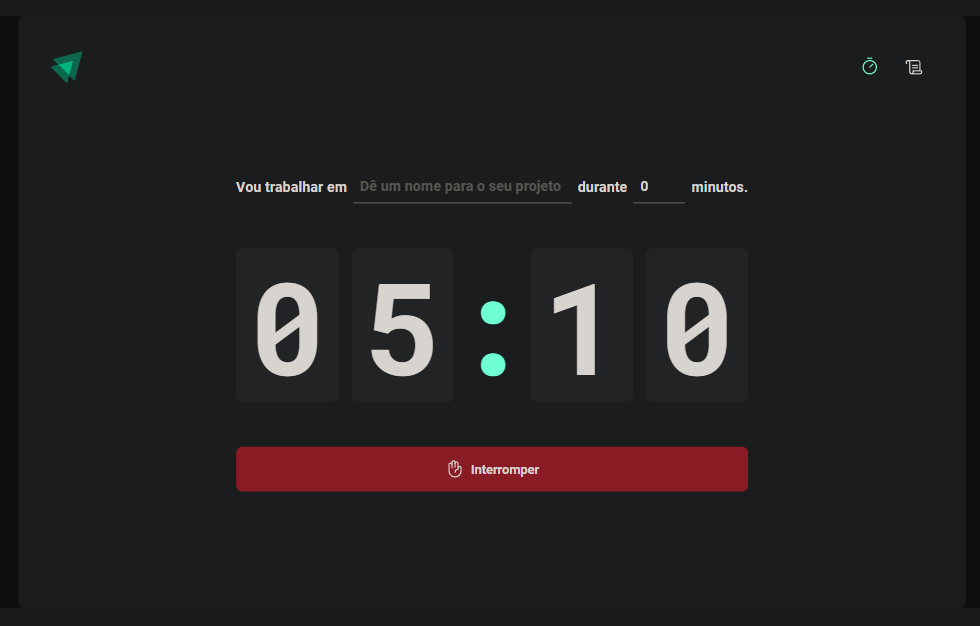

# Ignite Timer




> "Contrução de uma aplicação completa com roteamento e diversos conceitos importantes do ecossistema [🔗 React](https://pt-br.legacy.reactjs.org/docs/getting-started.html) como ContextAPI, useReducer, immer e muito mais" - [🔗 Rocketseat](https://www.rocketseat.com.br/ignite).

## 🚀 Instalando o Ignite Timer

> Para instalar o ignite-timer, siga estas etapas:

- Para instalar todas as dependencias do projeto
```
npm install
```
ou
```
npm i
```

- Para rodar o projeto
```
npm run dev
```

